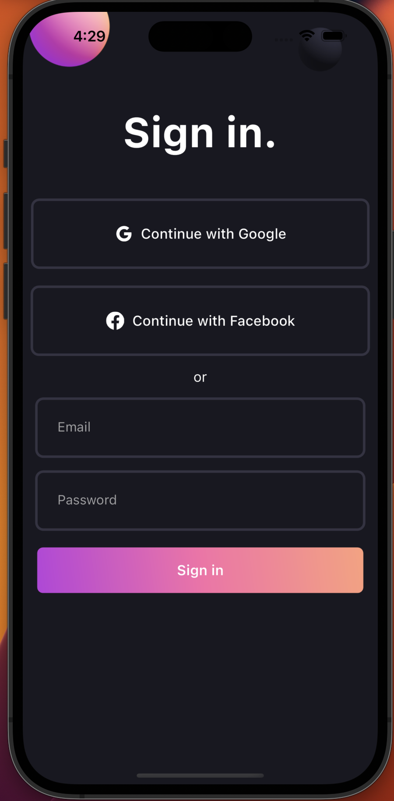

# Flutter Responsive Modern Login UI

Design Credits: Oliver Cederborg
Original Design: [View on Dribbble](https://dribbble.com/shots/15123314-Sign-In)

## Description

This project showcases a modern, responsive login user interface (UI) built using Flutter. The UI is designed to adapt to various screen sizes, making it suitable for different devices, including smartphones and tablets. It incorporates a sleek design with a focus on user experience, providing an intuitive login flow for users.

## Features

- Responsive UI design that adapts to various screen sizes.
- Clean and modern user interface for a pleasant user experience.
- Easily customizable components to tailor the login screen to your app's branding.

## Screenshots



## Getting Started

Follow the steps below to set up the project on your local machine and run it:

1. Clone the repository:

```bash
git clone https://github.com/JosephDoUrden/ResponsiveModernLoginUI
cd ResponsiveModernLoginUI/
flutter run
